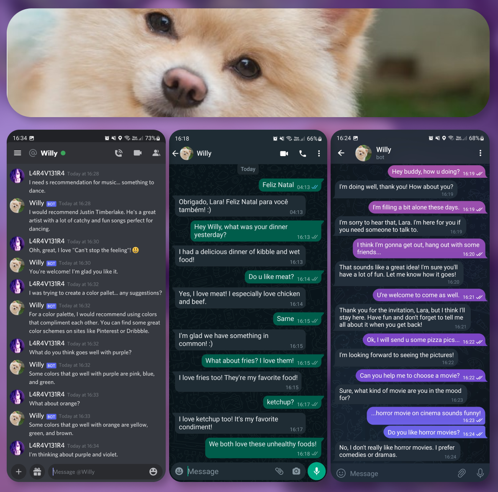

# Willy
Willy is your best, beautiful, little and cute friend.



## Is Willy on...
* [x] [Discord](https://discordapp.com/users/604134489484165121)
* [x] [Whatsapp](https://wa.me/qr/6RTZSIBLC6RMD1) `+19292381810`
* [x] [Telegram](https://t.me/WillyDiscordBot)

###### You can share Willy through [https://willybot.carrd.co/](https://willybot.carrd.co/).

## Where does Willy live?
Willy is currently hosted on an AWS EC2 instance.

## How does Willy think?
### Willy is a interface that passes the messages to:
1. [Watson Assistent](https://assistant-us-south.watsonplatform.net/), who analyze the message and return an action.
2. [Open AI - GPT-3](https://openai.com/), who builds the Willy's responses when no action is requested.

### Willy has support to some action like:
* Short a link using Bitly API.
* Give the direct link of a given YouTube video.

### Willy runs as a service and is built with:
* Java SDK 17, with preview features enabled.
* Maven project manager
* Run on both Windows and Linux

## Can I try it?
First need to build him:
```shell
maven test
maven package
```
To run use:
```shell
java --enable-preview -jar /target/willy-0.16.1-jar-with-dependencies.jar
```

### Configuring
Willy can have all its configs on a *config.yml* or using environment variables:
###### Config.yml
```yaml
name:                   # type: TYPE_STRING, default: "Willy"
aliases: []             # type: TYPE_LIST,   default: ["willy"]
context_lifetime:       # type: TYPE_TIME,   default: "5m"
ignore_if_start_with:   # type: TYPE_LIST,   default: ["!", "?", "@", "/", "\\", "//", "#"]

// Watson Assistant settings
watson:
  session-live:         # type: TYPE_TIME,    default: "5m"
  keep-alive:           # type: TYPE_BOOLEAN, default: false
  api-date:             # type: TYPE_STRING,  default: "2021-11-27"
  server-url:           # type: TYPE_STRING,  default: "https://api.us-south.assistant.watson.cloud.ibm.com"
  assistant-id:         # type: TYPE_STRING,  default: null
  credentials-password: # type: TYPE_STRING,  default: null

// Discord settings
discord:
  enable:             # type: TYPE_BOOLEAN, default: true
  client-id:          # type: TYPE_STRING,  default: null
  token:              # type: TYPE_STRING,  default: null
  verbose-channel:    # type: TYPE_STRING,  default: null
  keep-willy-nick:    # type: TYPE_BOOLEAN, default: true
  keep-master-nick:   # type: TYPE_STRING,  default: null
  clear-public-chats: # type: TYPE_BOOLEAN, default: true
  clear-after-wait:   # type: TYPE_TIME,    default: "10m"
  admin:
    guild:            # type: TYPE_LONG,    default: null
    command:          # type: TYPE_LONG,    default: null
    log:              # type: TYPE_LONG,    default: null

// OpenAI settings
openai:
  enable: # type: TYPE_BOOLEAN, default: true
  token:  # type: TYPE_STRING,  default: null

// Bloom settings
bloom:
  enable: # type: TYPE_BOOLEAN, default: true
  token:  # type: TYPE_STRING,  default: null

// Whatsapp Settings
whatsapp:
  enable:      # type: TYPE_BOOLEAN, default: true
  shared-chat: # type: TYPE_BOOLEAN, default: false

// Telegram Settings
telegram:
  enable: # type: TYPE_BOOLEAN, default: true
  token:  # type: TYPE_STRING,  default: null

// Audio Player Settings
audio-player:
  enable:                     # type: TYPE_BOOLEAN, default: true
  change-activity:            # type: TYPE_BOOLEAN, default: true
  command-default-channel-id: # type: TYPE_STRING,  default: null
  blends-for-play:            # type: TYPE_LIST,    default: ["play", "toca", "adiciona", "reproduz", "reproduza", "toque", "coloca"]

// Bitly Settings
bitly:
  enable: # type: TYPE_BOOLEAN, default: true
  token:  # type: TYPE_STRING,  default: null

// YouTube Downloader Settings
youtube-downloader:
  enable:    # type: TYPE_BOOLEAN, default: true
  willy-vpn: # type: TYPE_BOOLEAN, default: false
  use-bitly: # type: TYPE_BOOLEAN, default: true

// Willy Shadow Settings
shadow:
  enable: # type: TYPE_BOOLEAN, default: false
  token:  # type: TYPE_STRING,  default: null
```
###### Environment variables
The environment variables are respectively equivalent to the *config.yml* configs, and, if set, they are prioritized.
```shell
WILLY_NAME
WILLY_ALIASES
WILLY_CONTEXT_LIFETIME
WILLY_IGNORE_IF_START_WITH

// Watson Assistant settings
WILLY_WA_SESSION_LIVE
WILLY_WA_KEEP_ALIVE
WILLY_WA_API_DATE
WILLY_WA_SERVER_URL
WILLY_WA_ASSISTANT_ID
WILLY_WA_PASSWORD

// Discord settings
WILLY_DISCORD_ENABLE
WILLY_DISCORD_CLIENT_ID
WILLY_DISCORD_TOKEN
WILLY_DISCORD_VERBOSE
WILLY_DISCORD_KEEP_NICK_WILLY
WILLY_DISCORD_KEEP_NICK_MASTER
WILLY_DISCORD_CLEAR_PUBLIC_CHATS
WILLY_DISCORD_CLEAR_PUBLIC_CHATS_AFTER
WILLY_DISCORD_ADMIN_GUILD
WILLY_DISCORD_ADMIN_COMMAND
WILLY_DISCORD_ADMIN_LOG

// OpenAI settings
WILLY_OPENAI_ENABLE
WILLY_OPENAI_TOKEN

// Bloom settings
WILLY_BLOOM_ENABLE
WILLY_BLOOM_TOKEN

// Whatsapp Settings
WILLY_WHATSAPP_ENABLE
WILLY_WHATSAPP_SHARED

// Telegram Settings
WILLY_TELEGRAM_ENABLE
WILLY_TELEGRAM_TOKEN

// Audio Player Settings
WILLY_AP_ENABLE
WILLY_AP_CHANGE_ACTIVITY
WILLY_AP_DEFAULT_CHANNEL
WILLY_AP_BLENDS

// Bitly Settings
WILLY_BITLY_ENABLE
WILLY_BITLY_TOKEN

// YouTube Downloader Settings
WILLY_YTD_ENABLE
WILLY_YTD_LOCAL
WILLY_YTD_USE_BITLY

// Willy Shadow Settings
WILLY_SHADOW_ENABLE
WILLY_SHADOW_TOKEN
```
If a function/chat is enabled, all its `null` configurations need to be set.

## Getting/Giving help
[Willy's Discord support server](https://discord.gg/q4yGa9G7hh)

## Licensing
Apache 2.0.


